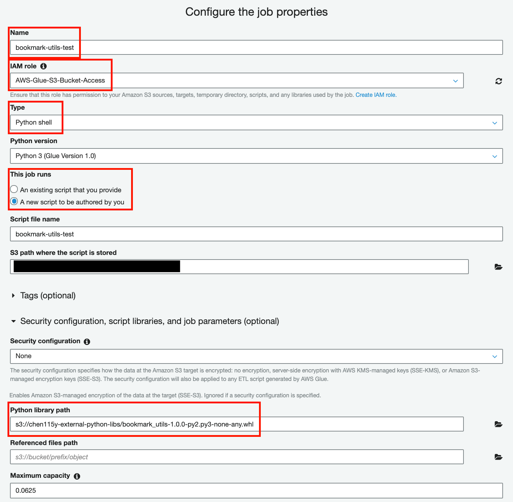
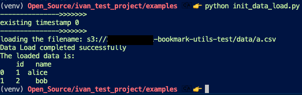
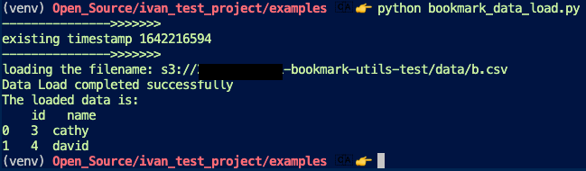
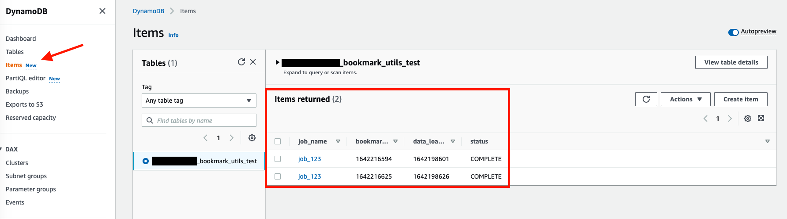
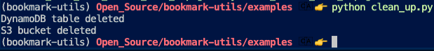

Bookmark Utils
==============================================================================

``bookmark_utils`` is a Python library that presents a solution to separate processed and unprocessed data from data sources when doing data processing with Glue Python Shell jobs. Specifically, this library will load the data from (csv) files on a S3 bucket and create a bookmark for the processed/loaded data in a DynamoDB table. Later, only new data files added into the S3 bucket will be processed/loaded by this library. The formerly processed/loaded data won't be loaded again. This will prevent duplicating data.

.. contents:: Table of Content
    :depth: 1
    :local:

Features:
------------------------------------------------------------------------------

APIs for automated bookmark creation and data loading as a pandas dataframe.

Install
------------------------------------------------------------------------------

``bookmark_utils`` is released on PyPI, so all you need is:

.. code-block:: console

    $ pip install bookmark_utils

To upgrade to latest version:

.. code-block:: console

    $ pip install --upgrade bookmark_utils

If you want to install this library from a downloaded wheel file, you can do it as an example below:

.. code-block:: console

    $ pip install bookmark_utils-1.0.0-py2.py3-none-any.whl

Tutorial - Use this bookmark APIs for Glue Python Shell job development
------------------------------------------------------------------------------

**Prerequisites**

- Prepare an `AWS account <https://signin.aws.amazon.com/signin?redirect_uri=https%3A%2F%2Fportal.aws.amazon.com%2Fbilling%2Fsignup%2Fresume&client_id=signup>`_ and an IAM user with **AdministratorAccess** permission. For sign up to AWS, please refer to this `link <https://portal.aws.amazon.com/billing/signup>`_. For how to create an admin IAM user, please refer to this `AWS on-line document <https://docs.aws.amazon.com/mediapackage/latest/ug/setting-up-create-iam-user.html>`_.
- Prepare an IAM role for your Glue Python Shell job. This role should have full access to S3 buckets and DynamoDB.

**Create a Glue Python Shell Job**

- Upload the wheel file of this ``bookmark_utils`` library to one of your S3 bucket. Remember the S3 location of this wheel file. For example, ``s3://chen115y-external-python-libs/bookmark_utils-1.0.0-py2.py3-none-any.whl``.
- Upload a csv data file to one of your S3 bucket. Remember the S3 buket name and prefix/folder name of this csv file.
- Go to `Glue service console <https://console.aws.amazon.com/glue/>`_ and create a new Glue Python Shell job. The following screen shot shows an example of this job setup:

- Copy and paste the code below into the Glue Python Shell job script area. Replace the values of s3_bucket, s3_prefix and dynamodb_table with yours.

.. code-block:: python

    import boto3
    import numpy as np
    import pandas as pd
    import bookmark_utils
    from bookmark_utils import BookMarks

    boto_ses = boto3.session.Session()
    sts = boto_ses.client("sts")
    s3 = boto_ses.client("s3")
    dynamodb = boto_ses.client("dynamodb")
    s3_bucket = "your_s3_bucket_for_csv_data"
    s3_prefix = "your_s3_prefix"
    dynamodb_table = "your_dynamodb_table_name"
    # Initialize BookMarks
    bm = BookMarks(
            s3_bucket_name=s3_bucket,
            s3_location=s3_prefix,
            format_of_data="csv",
            job_name="bookmark-utils-test",
            dynamo_db_table_for_bookmark_storage=dynamodb_table,
        )
    # Load csv data files from the S3 bucket, create a bookmark in DynamoDB table 
    # and return the loaded data as a pandas dataframe
    df = bm.load_data_from_s3()
    bm.commit()
    # Display the data in the pandas dataframe
    print("The data in the dataframe is:\n", df)
    df.to_csv("bookmark-test.csv", header=True, index=False)
    s3.upload_file('bookmark-test.csv', Bucket=s3_bucket, Key='loaded/bookmark-test.csv')

- Save the job and run it. You should see the loaded data file "bookmark-test.csv" saved in the S3 bucket.

Tutorial - Use this bookmark APIs for local code development
------------------------------------------------------------------------------

**Prerequisites**

- Prepare an `AWS account <https://signin.aws.amazon.com/signin?redirect_uri=https%3A%2F%2Fportal.aws.amazon.com%2Fbilling%2Fsignup%2Fresume&client_id=signup>`_ and an IAM user with **AdministratorAccess** permission. For sign up to AWS, please refer to this `link <https://portal.aws.amazon.com/billing/signup>`_. For how to create an admin IAM user, please refer to this `AWS on-line document <https://docs.aws.amazon.com/mediapackage/latest/ug/setting-up-create-iam-user.html>`_.
- Install and setup AWS Command Line Interface (CLI) at your local environment. For how to install and setup AWS CLI, please refer to this `on-line document <https://docs.aws.amazon.com/cli/latest/userguide/cli-chap-getting-started.html>`_.
- Install and setup `Python 3 virtual environment <https://docs.python.org/3/library/venv.html>`_.

**Run Sample Code**

- Install this ``bookmark_utils`` library in your local environment.
- Clone this GitHub repo by using ``git clone`` command line.
- Go to ``example`` folder of this repo.
- In a terminal, run the command of ``python init_data_load.py``. The results look like below:

- Then run the command of ``python3 bookmark_data_load.py``. The results look like below:

After this step, you should see a similar result shown as the screen shot below on the DynamoDB table:

**Clean Up**

- Go to the folder of ``examples``. 
- Run the command of ``python clean_up.py`` in a terminal to clean up the S3 bucket and the DynamoDB bookmark table, which were created when running sample codes above. The results look like below:

Dev Runbook
------------------------------------------------------------------------------

1. Setup Virtualenv:

.. code-block:: bash

    # Create a Python virtual environment for dev / test
    $ virtualenv -p python3.8 venv

    # Enter virtualenv
    $ source ./venv/bin/activate

    # pip install this library and dependencies
    $ pip install -e .

2. Run Tests:

.. code-block:: bash

    # pip install test dependencies
    # NOTE YOU MAY NEED TO RE-ENTER virtualenv
    $ pip install -r requirements-test.txt

    # run unit test and code coverage test
    $ pytest tests -s --cov=bookmark_utils --cov-report term-missing --cov-report "annotate:bookmark-utils/.coverage.annotate"

3. Package and Publish:

.. code-block:: bash

    # pip install development dependencies
    # NOTE YOU MAY NEED TO RE-ENTER virtualenv
    $ pip install -r requirements-dev.txt

    # build artifacts locally
    $ bash ./bin/build.sh

    # publish to https://pypi.org
    $ bash ./bin/publish.sh

1. Then create a release branch ``release/x.y.z`` that match the version.
2. Tag the repo from this branch using naming convention ``x.y.z``.
3. Create a GitHub Release that name matching this version using naming convention ``x.y.z``, and upload the ``.whl`` file to the Release.
